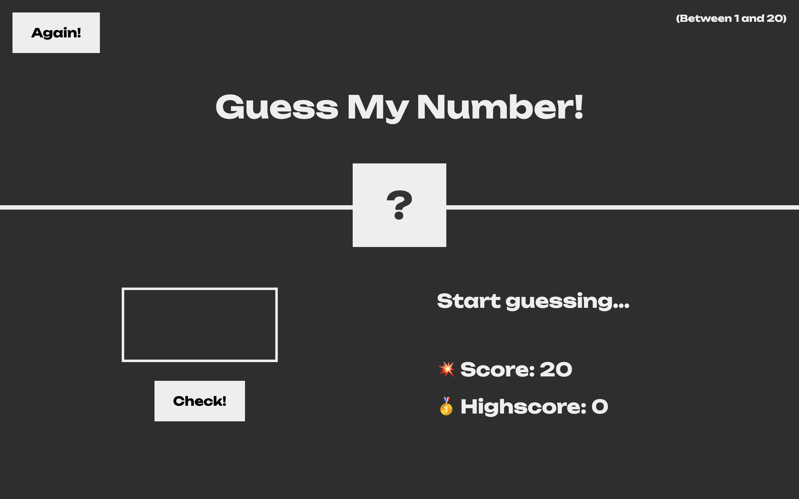

<h1 align="center">Guess the Number</h1>

This website was built to practice my knowlegde in JavaScript and DOM. Basically you need to guess a random number between 1 and 20. How fast can you do it?

<a href="#-tecnologies">Tecnologies</a>
<a href="#-project">Project</a>

## Tecnologies

This project was built with:

- HTML and CSS
- Javascript
- DOM

## Project

- Guess the number is a web site for people guess a random number between 1 and 20.
- On the scream you can see if the guess was greater or lower than the chosen random number.
- You can start again using the button "Again!". Guessing the number your "Score" will be saved in "Highscore" and it can increase if you guess the number faster than before.
- You can accumulate "Highscore" during the game, so try your best!

- <a href= "https://kauanatomb.github.io/Guess-my-number/">Acess the finished project online</a>
